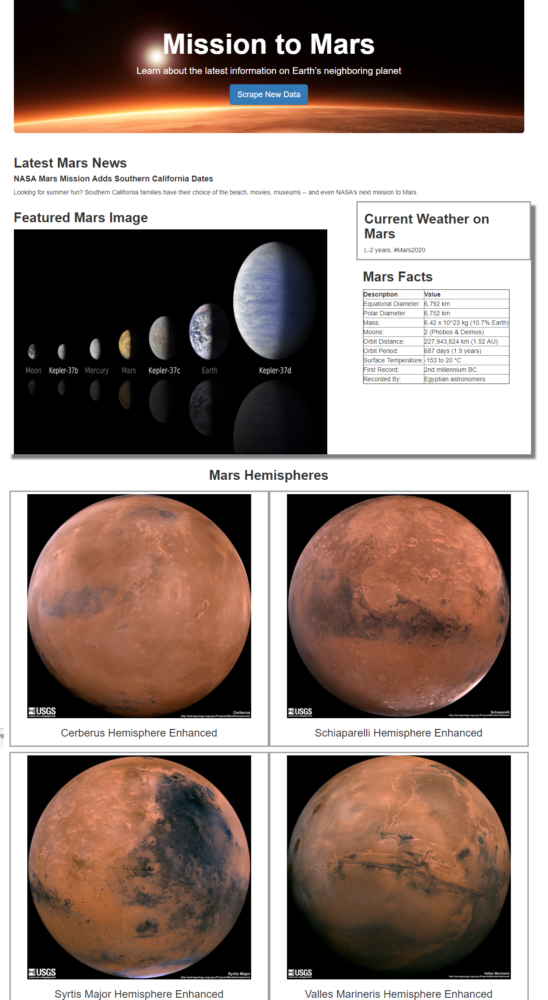

# Mission to Mars
In this two-part project, I built a web application that scrapes various websites for Mars-related data.

## Part 1 - Scraping
The initial scraping was done in `mission_to_mars.ipynb` using BeautifulSoup, Pandas, and Splinter.
### Websites used for web scraping included:
- [NASA Mars News Site](https://mars.nasa.gov/news/?page=0&per_page=40&order=publish_date+desc%2Ccreated_at+desc&search=&category=19%2C165%2C184%2C204&blank_scope=Latest) for recent news articles
- [JPL Mars Space Images](https://www.jpl.nasa.gov/spaceimages/?search=&category=Mars) for the current Featured Mars Image
- [Mars Weather Twitter](https://twitter.com/marswxreport?lang=en) for the current weather update on Mars
- [Mars Facts](https://space-facts.com/mars/) where data was scraped and converted to html code using Pandas
- [Mars Hemispheres](https://astrogeology.usgs.gov/search/results?q=hemisphere+enhanced&k1=target&v1=Mars) for high resolution images

## Part 2 - MongoDB and Flask Application
MongoDB with Flask templating was used to create a HTML page that displayed the data scraped from the above URLs.
- The Jupyter Notebook file was converted into a Python file, `scrape_mars.py`, with the function `scrape` that executes the code and stores it in a dictionary.
- The template file `index.html` will display the dictionary information in the appropriate HTML elements.
- The `app.py` file must run with MongoDB in order for the application to work.

### Screenshot of Homepage:

